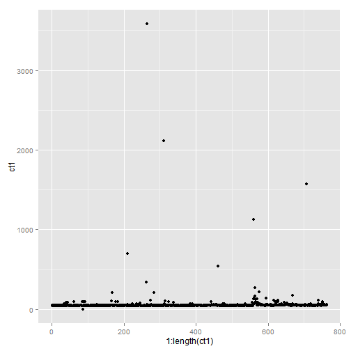
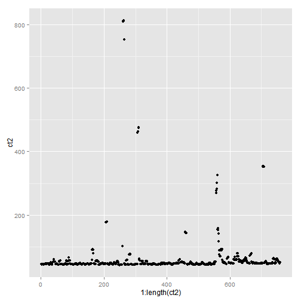
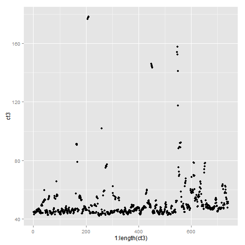

---
title       : Cycle Time Measurement based on Productions Logs 
subtitle    : Method proposed
author      : Jorge Hermoso
job         : Analyst
framework   : io2012   # {io2012, html5slides, shower, dzslides, ...}
highlighter : highlight.js  # {highlight.js, prettify, highlight}
hitheme     : tomorrow      # 
widgets     : []            # {mathjax, quiz, bootstrap}
mode        : selfcontained # {standalone, draft}
knit        : slidify::knit2slides

--- .class #id 

## Current methods and issues

To obtain and accurate measure of the cycle time it is necessary to divide the number of parts by a unit of time, but the resulting values is only significant for production estimation while remains completely useless for production modeling as it masks the real capacity of the cells.

The main problem is that to obtain a significant measure on CT the calculations need to automatically cope with a few elements:

1. Big delays produced by machine time down
2. Small runs of protype series
3. Inefficiency of operators to feed machine
4. Others

In order to get an automatic value of the process time the calculation algorithm needs to account for all these factors.


```
## Warning: cannot open file 'data.csv': No such file or directory
```

```
## Error: cannot open the connection
```


--- .class #id 

## Processing I

Assuming the data in a proper timestamp format the first step is to filter by Pass result:

```r
clean <- data[data$result == "1", ]  #1 stands for pass in the results
```

Then calculate time intervals

```r
ct <- diff(strptime(clean$timestamp, "%H:%M:%S"))
```

And have a first galnce to the data:

```
##    Min. 1st Qu.  Median    Mean 3rd Qu.    Max. 
##  -35900      43      46     -22      49    6370
```


--- &twocol 

## Processing II

*** =left

Let's get rid of the first level of noise by cutting on the median with a span of +/- 2 sigma


```r
ct1 <- as.numeric(ct)
ct1 <- ct1[ct1 < (median(ct1) + sd(ct1) * 2) & ct1 > (median(ct1) - sd(ct1) * 
    2)]
```

Now that we got rid of all the machine stops it is possible to evaluate the amount of variaton in a regular proces.

*** =right

 


--- &twocol 

## Processing II

Let's filter this data by using a moving average filter

*** =left

```r
ma5 = c(1, 1, 1, 1, 1)/5
ct2 <- as.numeric(filter(ct1, ma5))
ct2 <- ct2[!is.na(ct2)]
```

*** =right
 


--- &twocol 

## Processing III

Finally let's recalculate the median on the filtered data and give a threshold of two sigma again. 

*** =left

```r
ct3 <- ct2[ct2 < (median(ct2) + sd(ct2) * 2) & ct2 > (median(ct2) - sd(ct2) * 
    2)]
summary(ct3)
```

```
##    Min. 1st Qu.  Median    Mean 3rd Qu.    Max. 
##    42.2    44.8    46.9    51.6    51.0   178.0
```


We can conclude that our process has a stable CT of 46.90s

The value of the mean is now more representative as well compared to the -22 second at the beginning of the study.

*** =right
 

